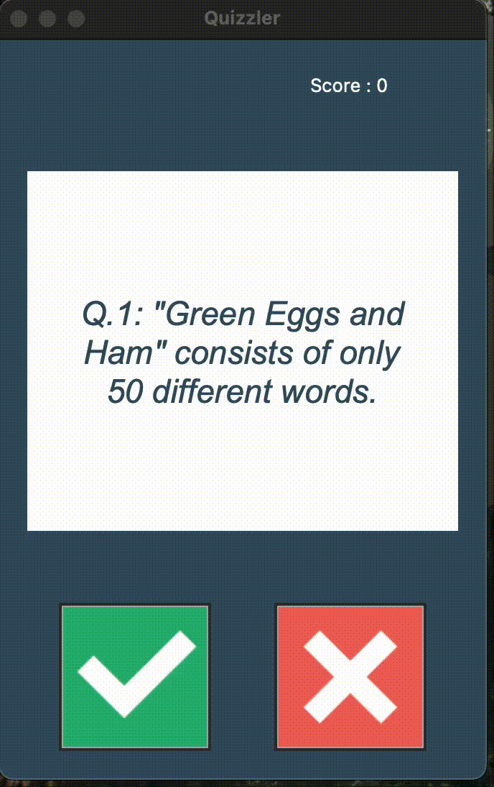

# Quizzler App

A sleek, GUI-based quiz application built with Python and Tkinter. The app fetches dynamic trivia questions from the Open Trivia Database API, covering topics like entertainment, music, news, and fun facts.

## Features

* **Dynamic Questions**: Pulls real-time True/False questions via API.

* **Interactive UI**: A clean interface built with Tkinter, featuring score tracking and visual feedback (green/red) for answers.

* **OOP Architecture**: Organized into modular classes:

    * *QuizInterface*: Handles the graphical display and user interactions.

    * *QuizBrain*: Manages the quiz logic, score keeping, and question progression.

    * *Question*: The data model for individual quiz questions.

    * *Data*: Handles the API request and data formatting.

## Built With

* **Language**: Python 3

* **Library**: Tkinter (GUI)

* **API**: Open Trivia DB

* **Modules**: `requests`, `html`

## Prerequisites

Before running the project, ensure you have the requests library installed:

`pip install requests`

## Project Structure

* *`main.py`*: The entry point of the application.

* *`ui.py`*: Contains the QuizInterface class for the Tkinter UI.

* *`quiz_brain.py`*: Contains the logic for checking answers and managing the quiz flow.

* *`question_model.py`*: Defines the Question class.

* *`data.py`*: Fetches question data from the API.

## Preview

